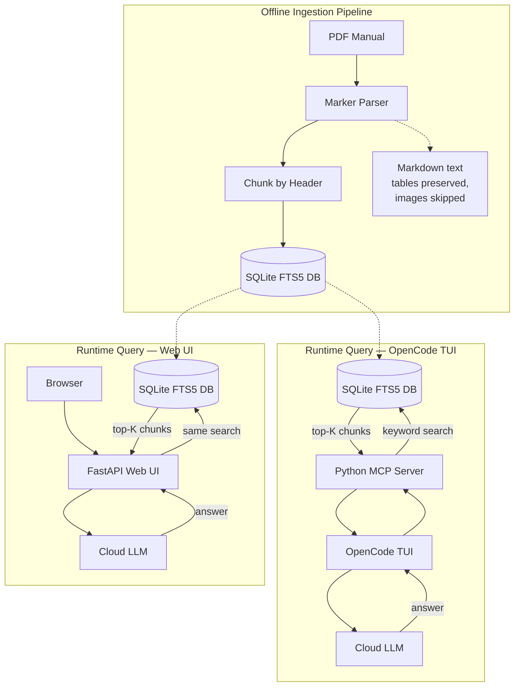

# Local-First, Layout-Aware Manual Assistant

## Project Overview

A terminal-and-browser tool that indexes owner's manual PDFs and answers natural language questions about them using FTS5 retrieval + cloud LLMs.

## System Architecture

Two independent domains: an offline ingestion pipeline (run once per document) and a runtime server (MCP for OpenCode + FastAPI for web), both querying the same SQLite FTS5 database.



## Core Tech Stack

| Component | Technology | Justification |
|---|---|---|
| Frontend (TUI) | OpenCode (MCP tool) | Keyboard-driven; natively supports MCP servers |
| Frontend (Web) | FastAPI + Jinja2 | Minimal secondary UI for browser access |
| Orchestration | Python MCP SDK | JSON-RPC between OpenCode and server |
| PDF Extraction | Marker (Python) | Strips multi-column, outputs native Markdown with tables |
| Storage | SQLite + FTS5 | Zero-config, built-in full-text search |
| Generation | Cloud LLM API | No local model setup (OpenCode Go / OpenAI / Anthropic) |

## Schema

```sql
CREATE TABLE IF NOT EXISTS documents (
    id INTEGER PRIMARY KEY AUTOINCREMENT,
    filename TEXT NOT NULL,
    category TEXT       -- e.g., "Automotive", "Appliances"
);

CREATE TABLE IF NOT EXISTS document_chunks (
    id INTEGER PRIMARY KEY AUTOINCREMENT,
    document_id INTEGER NOT NULL,
    heading_path TEXT,  -- e.g., "Engine Maintenance > Oil Change"
    content_markdown TEXT NOT NULL,
    FOREIGN KEY (document_id) REFERENCES documents(id)
);

CREATE VIRTUAL TABLE IF NOT EXISTS chunks_fts USING fts5(
    content_markdown,
    heading_path,
    content='document_chunks',
    content_rowid='id'
);

-- Triggers to keep FTS index in sync with document_chunks
CREATE TRIGGER IF NOT EXISTS chunks_ai AFTER INSERT ON document_chunks BEGIN
    INSERT INTO chunks_fts(rowid, content_markdown, heading_path)
    VALUES (new.id, new.content_markdown, new.heading_path);
END;

CREATE TRIGGER IF NOT EXISTS chunks_ad AFTER DELETE ON document_chunks BEGIN
    INSERT INTO chunks_fts(chunks_fts, rowid, content_markdown, heading_path)
    VALUES ('delete', old.id, old.content_markdown, old.heading_path);
END;

CREATE TRIGGER IF NOT EXISTS chunks_au AFTER UPDATE ON document_chunks BEGIN
    INSERT INTO chunks_fts(chunks_fts, rowid, content_markdown, heading_path)
    VALUES ('delete', old.id, old.content_markdown, old.heading_path);
    INSERT INTO chunks_fts(rowid, content_markdown, heading_path)
    VALUES (new.id, new.content_markdown, new.heading_path);
END;
```

## Phase 1: Storage Foundation

- Database file: `manuals_knowledge.db` in a configurable data directory
- Create tables and FTS5 virtual table with sync triggers
- Enable WAL mode (`PRAGMA journal_mode=WAL;`) for concurrent-read safety during ingest
- No vector tables — FTS5 replaces semantic search for v1

## Phase 2: Ingestion Pipeline (`ingest.py`)

Standalone script, run once per manual.

1. **Parse PDF:** `marker_single input.pdf output_dir/` produces Markdown
 2. **Structural chunking:** Split on any ATX heading (`^#{1,} `)
    - Track fenced code blocks to avoid false `#` matches inside them
    - Content before the first heading stored under heading_path `"(preamble)"`
    - Content after the last heading stored under heading_path `"(postamble)"`
    - Tables stay intact inside their containing header block
    - Image references (both inline `` and reference-style `![alt][ref]`) are stripped — not parsed in v1
 3. **Store:** Insert document record → insert chunks in a transaction (no partial state on crash) → FTS index auto-populates via trigger
 4. **Cleanup:** Marker-generated media files are removed after ingestion (temp directory)
 5. **Error handling:** Marker failures raise a clear error; partial output is discarded
 6. **Usage:** `python ingest.py --file path/to/manual.pdf --category Automotive`

Flags:
- `--file` (required): path to PDF
- `--category` (optional): e.g., "Automotive", "Appliances"

## Phase 3: MCP Server (`mcp_server.py`)

Powered by the Python MCP SDK. Runs as a background process registered with OpenCode.

### Exposed Tool

```
search_manuals(query: str, category: str | None = None) -> str
```

### Internal Logic

1. Receive query string from OpenCode client
2. Sanitize query: strip FTS5 special chars (`"`, `*`, `+`, `(`, `)`, `^`, `~`, `:`) to avoid syntax errors and unbounded searches
3. Run FTS5 search (wrapped in `try/except OperationalError` — returns empty on syntax errors):

```sql
SELECT doc.filename, doc.category, chunk.heading_path, chunk.content_markdown,
       rank
FROM chunks_fts
JOIN document_chunks chunk ON chunks_fts.rowid = chunk.id
JOIN documents doc ON chunk.document_id = doc.id
WHERE chunks_fts MATCH ?
  AND (? IS NULL OR doc.category = ?)
ORDER BY rank
LIMIT ?;
```

4. If no results: return `"I couldn't find relevant information in your manuals."`
5. If results found: return top-K chunks as structured context
6. OpenCode's own LLM synthesizes the final answer from the returned context

### Query Limits
- All user queries are truncated to 200 characters before reaching the database
- Query sanitization strips FTS5 special characters to prevent syntax injection and unbounded prefix searches
- Result limit is bounded to 1–50 in the web UI

### OpenCode Registration (`~/.config/opencode/config.json`)

```json
{
  "$schema": "https://opencode.ai/config.json",
  "mcp": {
    "diy-manuals": {
      "type": "local",
      "command": ["/absolute/path/to/.venv/bin/python", "/absolute/path/to/mcp_server.py"],
      "env": {
        "DATABASE_PATH": "/absolute/path/to/manuals_knowledge.db"
      }
    }
  }
}
```

Generation model configuration is handled by OpenCode's own settings — the MCP server returns chunks, not generated answers.

## Phase 4: Web UI (`web_ui.py`)

Minimal FastAPI app for browser-based searching.

```
GET / → search form (text input + category dropdown)
GET /search?q=...&category=... → results page
```

- Reuses the same search logic as the MCP server (shared query module)
- No LLM generation call — displays raw chunks for manual browsing
- Simple HTML templates (Jinja2), no JavaScript framework
- Served on `http://localhost:8080`

## Design Decisions (v1)

| Decision | Choice |
|---|---|
| Retrieval | FTS5 keyword search (no vector embeddings) |
| Generation | Cloud LLM (OpenCode Go / OpenAI / Anthropic) |
| Image parsing | Skipped — text and tables only |
| Batch ingestion | Out of scope — one manual at a time |
| Category filter | Manual assignment at ingest time |
| Multi-manual queries | Results from all matching manuals, labeled by filename |
| No-match behavior | "I couldn't find relevant information" — no fallback |
| FTS5 sanitization | Strip all special chars (`"*+()^~:`) — prevent unbounded prefix search and syntax errors |
| Query length | Capped at 200 chars in both MCP and web UI |
| Async DB access | Offloaded with `asyncio.to_thread()` to avoid blocking event loop |
| OpenCode integration | Explicit tool invocation (not resource-based) |
| Web UI | Secondary access path — minimal FastAPI page |

## Out of Scope (v1)

- Local model inference (Ollama, llama.cpp, etc.)
- Vector embeddings / semantic search (sqlite-vec)
- Image and diagram parsing (llava or similar)
- Batch/multi-PDF ingestion
- Multi-user support
- Authentication
